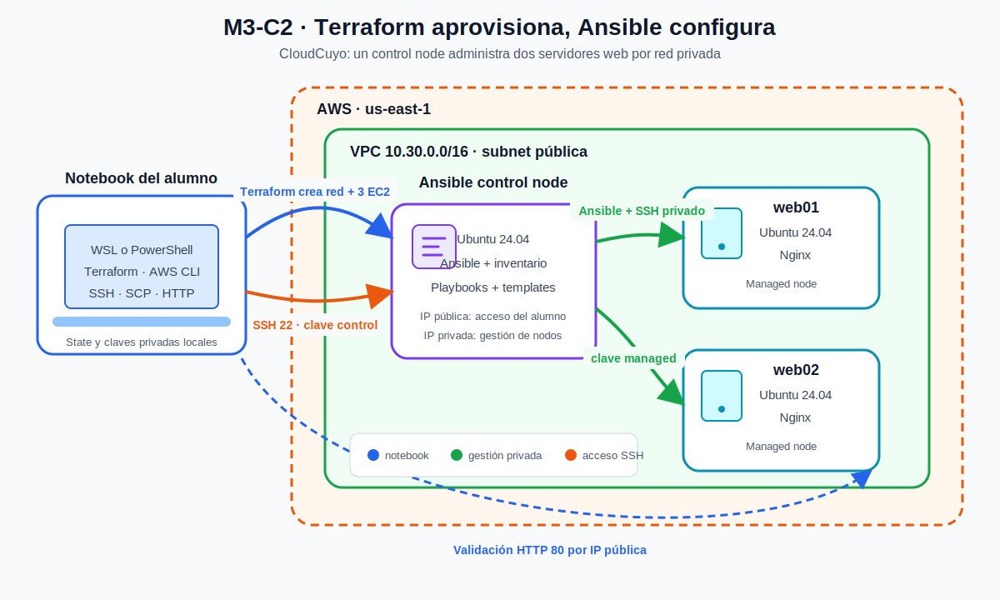

# Guía Ansible LAB01: infraestructura y control node con Terraform

**Módulo:** M3-C2 — Gestión de configuración con Ansible

**Duración estimada:** 75 a 90 minutos

**Región:** `us-east-1`

**Estado Terraform:** local

---

## 1. Contexto

CloudCuyo puede declarar recursos AWS con Terraform, pero todavía necesita entrar manualmente a cada servidor para instalar herramientas y dejarlo operativo. En este laboratorio vas a construir el punto de partida para automatizar esa configuración.

Terraform creará la red y tres instancias EC2. User Data instalará solamente las herramientas mínimas del control node. Después de conectarte, usarás Ansible contra `localhost` para completar su configuración.

La pregunta central es:

> ¿Dónde termina el aprovisionamiento de infraestructura y dónde comienza la gestión de configuración?

## 2. Objetivos de aprendizaje

Al finalizar podrás:

1. Reutilizar variables, data sources, locals, tags, outputs y módulos locales de Terraform.
2. Crear una VPC y tres instancias EC2 con reglas de acceso diferenciadas.
3. Explicar la función de User Data como mecanismo de bootstrap.
4. Mantener las claves privadas fuera de Terraform, User Data y Git.
5. Acceder al control node y comprobar el final de cloud-init.
6. Ejecutar un playbook con `connection: local`.
7. Diferenciar Terraform, bootstrap y Ansible.

## 3. Arquitectura



[Ver imagen en SVG](../assets/diagramas/m3-c2-ansible-terraform-aws.svg) · [Abrir fuente editable en Draw.io](../assets/diagramas/m3-c2-ansible-terraform-aws.drawio)

Lee el diagrama de izquierda a derecha:

1. La notebook conserva el state y las claves privadas.
2. Terraform crea la red y las tres instancias EC2.
3. La notebook accede por SSH al control node.
4. El control node ejecuta Ansible contra `web01` y `web02` usando sus IP privadas.
5. La notebook comprueba HTTP por las IP públicas de los servidores web.

Los tres nodos tienen salida a Internet para instalar paquetes. Los managed nodes poseen IP pública para la prueba HTTP de LAB02, pero no aceptan SSH desde Internet.

### Responsabilidades

| Capa | Responsabilidad |
|---|---|
| Terraform | VPC, subnet, rutas, Security Groups, claves públicas, EC2 y outputs |
| User Data | Instalar Ansible, Git, curl, jq y Python en el controller |
| Ansible local | Crear usuario, directorio y archivo operativo del controller |

## 4. Alcance

### Incluido

- Estado Terraform local.
- Una subnet pública sin NAT Gateway.
- Un control node y dos managed nodes Ubuntu 24.04.
- Un módulo local EC2 reutilizado tres veces.
- Dos pares de claves SSH con funciones separadas.
- Bootstrap y configuración local del controller.

### Fuera de alcance

- Backend remoto.
- Inventario dinámico AWS.
- Ansible Vault.
- Roles y Ansible Galaxy.
- ALB, Auto Scaling y alta disponibilidad.
- Uso productivo de una subnet pública.

## 5. Prerrequisitos

Validar herramientas desde WSL o Bash:

```bash
git --version
aws --version
terraform version
ssh -V
jq --version
```

Configurar el perfil y confirmar identidad.

### Bash o WSL

```bash
export AWS_PROFILE=curso
export AWS_REGION=us-east-1
aws sts get-caller-identity
```

### PowerShell

```powershell
$env:AWS_PROFILE = "curso"
$env:AWS_REGION = "us-east-1"
aws sts get-caller-identity
```

**Por qué se hace así:** definir el perfil y la región evita que Terraform use por error otra cuenta o región configurada en la computadora. Revisa la identidad devuelta por STS antes de crear recursos.

Debes contar con permisos para crear y eliminar VPC, subnets, rutas, Security Groups, key pairs y tres instancias EC2.

## Actividades

Las actividades siguientes construyen y verifican el laboratorio en orden. No avances al `apply` sin completar los checkpoints previos.

## 6. Obtener el material

```bash
git clone https://github.com/nicopannu/curso-cloud-formatec-c2-2026.git
cd curso-cloud-formatec-c2-2026
git checkout m3-c2-lab
```

Estos comandos funcionan igual en Bash, WSL y PowerShell.

**Por qué se hace así:** cambiar explícitamente a `m3-c2-lab` garantiza que la infraestructura, los playbooks y la guía correspondan a la misma versión.

Ejecutar la validación local:

```bash
./scripts/validate-lab.sh
```

El script se ejecuta desde Bash o WSL. Si comenzaste en PowerShell, entra primero a WSL con `wsl`.

**Por qué se hace así:** la validación detecta errores de formato y sintaxis antes de que Terraform intente comunicarse con AWS.

## 7. Revisar el proyecto Terraform

```bash
cd terraform/ansible-aws-lab
tree -a -I .terraform
```

Identifica:

- el root module;
- el child module `modules/ec2-instance`;
- las tres llamadas al módulo en `main.tf`;
- el data source de Ubuntu;
- los tags calculados en `locals.tf`;
- los outputs que después alimentarán a Ansible.

### Checkpoint 1

Antes de continuar, responde:

1. ¿Por qué los Security Groups permanecen en el root module?
2. ¿Qué inputs recibe el módulo EC2?
3. ¿Qué datos devuelve mediante outputs?
4. ¿Qué archivos formarán parte del state local?

## 8. Crear dos pares de claves SSH

Desde la notebook crea dos pares de claves.

### Bash o WSL

```bash
mkdir -p ~/.ssh
ssh-keygen -t ed25519 -f ~/.ssh/formatec-control -C formatec-control
ssh-keygen -t ed25519 -f ~/.ssh/formatec-managed -C formatec-managed
chmod 600 ~/.ssh/formatec-control ~/.ssh/formatec-managed
```

### PowerShell

```powershell
New-Item -ItemType Directory -Force "$HOME\.ssh" | Out-Null
ssh-keygen -t ed25519 -f "$HOME\.ssh\formatec-control" -C formatec-control
ssh-keygen -t ed25519 -f "$HOME\.ssh\formatec-managed" -C formatec-managed

icacls "$HOME\.ssh\formatec-control" /inheritance:r
icacls "$HOME\.ssh\formatec-control" /grant:r "${env:USERNAME}:(R)"
icacls "$HOME\.ssh\formatec-managed" /inheritance:r
icacls "$HOME\.ssh\formatec-managed" /grant:r "${env:USERNAME}:(R)"
```

Funciones:

- `formatec-control`: notebook → control node;
- `formatec-managed`: control node → web01/web02.

**Por qué se hace así:** separar las claves evita que la credencial usada para entrar al controller sea también la credencial usada para administrar todos los servidores. Cada clave tiene un alcance reconocible y puede revocarse de forma independiente.

Terraform leerá únicamente los archivos `.pub`. No copies las claves privadas dentro del proyecto Terraform.

**Por qué Terraform recibe sólo claves públicas:** una clave privada incluida en Terraform o User Data podría quedar guardada en el state o en logs de bootstrap.

## 9. Configurar variables

### Bash o WSL

```bash
cp terraform.tfvars.example terraform.tfvars
curl -fsS https://checkip.amazonaws.com
```

### PowerShell

```powershell
Copy-Item terraform.tfvars.example terraform.tfvars
(Invoke-RestMethod -Uri "https://checkip.amazonaws.com").Trim()
```

Edita `terraform.tfvars`:

```hcl
aws_region       = "us-east-1"
project          = "cloudcuyo"
environment      = "lab"
student_identity = "tu-identidad"
student_cidr     = "TU_IP_PUBLICA/32"
instance_type    = "t3.micro"

control_public_key_path = "~/.ssh/formatec-control.pub"
managed_public_key_path = "~/.ssh/formatec-managed.pub"
```

`terraform.tfvars` está ignorado por Git.

**Por qué se hace así:** el archivo separa valores personales del código reutilizable. El `/32` de `student_cidr` permite acceso solamente desde tu IP pública actual.

## 10. Inicializar y revisar

```bash
terraform init
terraform fmt -check -recursive
terraform validate
terraform plan -out=tfplan
```

Los comandos funcionan igual en Bash, WSL y PowerShell.

**Por qué se hace así:** `init` prepara providers y módulos, `validate` revisa la configuración y `plan` permite inspeccionar el cambio antes de ejecutarlo. Guardar `tfplan` permite aplicar exactamente el plan revisado.

El plan esperado incluye:

- una VPC;
- una subnet pública;
- un Internet Gateway;
- una tabla de rutas y asociación;
- dos Security Groups;
- dos key pairs con claves públicas;
- tres instancias EC2.

### Checkpoint 2

No apliques hasta verificar:

- cuenta y región correctas;
- exactamente tres instancias;
- SSH del controller limitado a tu `/32`;
- SSH de managed nodes referenciando el SG del controller;
- ausencia de claves privadas en el plan.

## 11. Crear la infraestructura

```bash
terraform apply tfplan
terraform output
```

**Por qué se hace así:** aplicar el archivo `tfplan` evita recalcular un plan diferente después de la revisión.

Guardar la IP del controller:

### Bash o WSL

```bash
CONTROL_IP="$(terraform output -raw ansible_control_public_ip)"
echo "$CONTROL_IP"
```

### PowerShell

```powershell
$CONTROL_IP = terraform output -raw ansible_control_public_ip
$CONTROL_IP
```

**Por qué se hace así:** el output evita buscar y copiar la IP manualmente desde la consola AWS.

Que una instancia esté `running` no significa que User Data terminó.

## 12. Acceder y esperar cloud-init

### Bash o WSL

```bash
ssh -i ~/.ssh/formatec-control ubuntu@"$CONTROL_IP"
```

### PowerShell

```powershell
ssh -i "$HOME\.ssh\formatec-control" "ubuntu@$CONTROL_IP"
```

A partir de la conexión SSH, los comandos se ejecutan en Ubuntu y por eso se muestran en Bash.

Dentro del controller:

```bash
cloud-init status --wait
sudo test -f /opt/cloudcuyo/bootstrap.env
ansible --version
git --version
jq --version
sudo tail -n 30 /var/log/cloudcuyo-bootstrap.log
```

Si `ansible` todavía no existe, revisa troubleshooting antes de repetir el `apply`.

**Por qué se espera cloud-init:** EC2 en estado `running` sólo confirma que la máquina arrancó; la instalación de paquetes puede continuar dentro del sistema operativo.

## 13. Preparar el proyecto en el controller

Dentro del controller:

```bash
cd ~
git clone https://github.com/nicopannu/curso-cloud-formatec-c2-2026.git
cd curso-cloud-formatec-c2-2026
git checkout m3-c2-lab
```

**Por qué se clona el repositorio en el controller:** Ansible ejecutará desde allí el inventario, los playbooks y los templates. Usar la misma branch evita copiar configuraciones fragmentadas sin trazabilidad.

Regresa a la notebook con `exit` y copia la clave administrada:

### Bash o WSL

```bash
scp -i ~/.ssh/formatec-control \
  ~/.ssh/formatec-managed \
  ubuntu@"$CONTROL_IP":~/.ssh/formatec-managed

ssh -i ~/.ssh/formatec-control ubuntu@"$CONTROL_IP" \
  'chmod 600 ~/.ssh/formatec-managed'
```

### PowerShell

```powershell
scp -i "$HOME\.ssh\formatec-control" `
  "$HOME\.ssh\formatec-managed" `
  "ubuntu@${CONTROL_IP}:~/.ssh/formatec-managed"

ssh -i "$HOME\.ssh\formatec-control" `
  "ubuntu@$CONTROL_IP" `
  "chmod 600 ~/.ssh/formatec-managed"
```

**Por qué se copia esta clave:** el control node será quien inicie SSH hacia `web01` y `web02`; por eso necesita la clave privada asociada a las claves públicas instaladas en esos nodos. La clave `formatec-control` no se copia: sólo permite entrar desde la notebook al controller.

**Por qué no se copia con Terraform o User Data:** Terraform podría almacenarla en el state y User Data podría exponerla en metadatos o logs. La copia explícita con `scp` hace visible la transferencia y permite aplicar inmediatamente el permiso `0600`.

Este mecanismo es temporal para el laboratorio. En un entorno productivo se debe evaluar un gestor de secretos, certificados SSH, agent forwarding o AWS Systems Manager.

La clave es temporal y se eliminará al destruir la instancia.

## 14. Configurar el control node con Ansible

Entra nuevamente al controller:

```bash
ssh -i ~/.ssh/formatec-control ubuntu@"$CONTROL_IP"
cd ~/curso-cloud-formatec-c2-2026/ansible
cp inventories/lab/hosts.ini.example inventories/lab/hosts.ini
ansible-playbook playbooks/control-node.yml
```

Validar:

```bash
getent passwd cloudcuyo
sudo cat /opt/cloudcuyo/control-node.conf
```

### Checkpoint 3 — primera configuración del controller

En este punto:

- User Data ya completó el bootstrap e instaló Ansible y las herramientas mínimas;
- `control-node.yml` realizó su primera corrida y completó la configuración del controller;
- `web01` y `web02` existen, pero todavía no fueron configurados con el playbook remoto;
- `web03` todavía no existe.

Si la clase continuará con LAB02 en otro momento, puedes detenerte aquí y conservar la infraestructura. No ejecutes todavía `playbooks/site.yml` ni agregues `web03`.

Ejecuta el mismo playbook una segunda vez cuando quieras comprobar idempotencia o continuar el recorrido completo de LAB01:

```bash
ansible-playbook playbooks/control-node.yml
```

La segunda ejecución debe finalizar sin errores y con `changed=0`.

**Por qué se ejecuta dos veces:** la primera corrida crea el estado deseado; la segunda demuestra idempotencia. Sin cambios en el playbook, una tarea estable no debería volver a modificar el sistema.

## 15. Troubleshooting

### SSH no responde

- Verifica `student_cidr`.
- Si cambió tu IP pública, actualiza `terraform.tfvars` y aplica el plan.
- Confirma que utilizas `formatec-control`, no la clave managed.

### Bootstrap incompleto

```bash
cloud-init status --long
sudo tail -n 100 /var/log/cloud-init-output.log
sudo tail -n 100 /var/log/cloudcuyo-bootstrap.log
```

No ejecutes manualmente comandos al azar antes de leer el error.

### Advertencia de host key

Si recreaste la instancia con otra IP:

### Bash o WSL

```bash
ssh-keygen -R "$CONTROL_IP"
```

### PowerShell

```powershell
ssh-keygen -R $CONTROL_IP
```

## 16. Entregables

Guardar en `lab01/` del repositorio personal:

- archivos Terraform y módulo local;
- `terraform.tfvars.example`, no el tfvars real;
- diagrama o explicación breve de arquitectura;
- resumen del plan;
- outputs sin claves ni secretos;
- evidencia de cloud-init completo;
- recap de las dos ejecuciones de `control-node.yml`;
- respuesta a los checkpoints.

## 17. Limpieza

LAB02 reutiliza esta infraestructura. No la destruyas todavía si continuarás inmediatamente.

Si finalizas aquí, desde la notebook y desde este directorio Terraform:

```bash
terraform destroy
```

El comando funciona igual en Bash, WSL y PowerShell.

**Por qué se hace así:** Terraform conoce las dependencias y elimina los recursos en un orden seguro. No borres instancias manualmente desde la consola porque el state quedaría desalineado.

Confirma que el state queda sin recursos:

```bash
terraform state list
```
