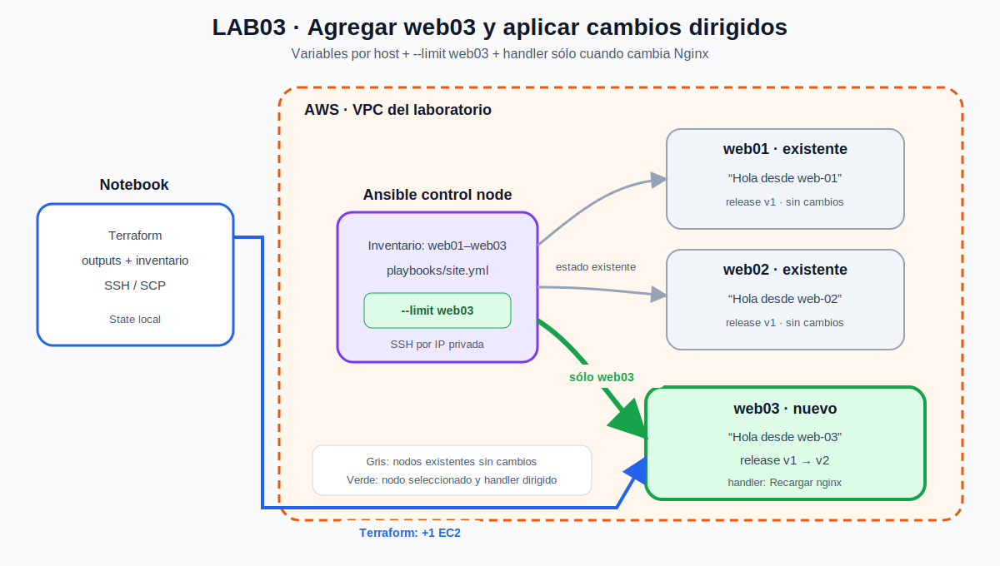

# Guía Ansible LAB03: cambios dirigidos y personalización por servidor

**Módulo:** M3-C2 — Gestión de configuración con Ansible

**Duración estimada:** 60 a 75 minutos

**Dependencia:** LAB01 y LAB02 completados

---

## 1. Contexto

CloudCuyo administra `web01` y `web02` con un mismo playbook. Ahora necesita incorporar `web03` sin volver a configurar innecesariamente los servidores existentes.

Cada servidor también debe mostrar un saludo propio:

- `Hola desde web-01`;
- `Hola desde web-02`;
- `Hola desde web-03`.

Después de incorporar el nuevo nodo, se aplicará un cambio de mensaje y release únicamente sobre `web03`. La pregunta central es:

> ¿Cómo puede Ansible reutilizar el mismo playbook, personalizar cada host y limitar una modificación a un servidor concreto?

## 2. Objetivos de aprendizaje

Al finalizar podrás:

1. Agregar una instancia EC2 reutilizando el módulo Terraform existente.
2. Generar un inventario con tres managed nodes.
3. Diferenciar variables de grupo y variables por host.
4. Renderizar un saludo distinto con el mismo template.
5. Usar `--limit` para seleccionar un único servidor.
6. Previsualizar una modificación con `--check --diff`.
7. Observar un handler ejecutado solamente sobre el host modificado.
8. Verificar contenido y cabeceras HTTP por servidor.
9. Confirmar idempotencia con una segunda ejecución.

## 3. Arquitectura



[Ver imagen en SVG](../assets/diagramas/m3-c2-lab03-web03-dirigido.svg) · [Abrir fuente editable en Draw.io](../assets/diagramas/m3-c2-lab03-web03-dirigido.drawio)

La infraestructura comienza con el controller, `web01` y `web02`. Terraform agrega únicamente `web03`. Ansible incorpora el nuevo host al grupo `web`, pero `--limit web03` restringe la ejecución al servidor seleccionado.

## 4. Alcance

### Incluido

- Una nueva EC2 `web03`.
- Reutilización del módulo EC2 existente.
- Inventario generado con tres managed nodes.
- Variables comunes en `group_vars`.
- Variables personalizadas en `host_vars`.
- Ejecución dirigida con `--limit`.
- Template, handler, HTTP e idempotencia.

### Fuera de alcance

- Roles.
- AWX o Automation Controller.
- Inventario dinámico.
- Ansible Vault.
- Despliegues rolling.
- Alta disponibilidad.
- Cambios de red o nuevos Security Groups.

## 5. Prerrequisitos

Antes de comenzar debes tener:

- LAB02 funcionando;
- `web01` y `web02` respondiendo HTTP;
- controller accesible por SSH;
- inventario y clave managed presentes en el controller;
- state Terraform local disponible en la notebook.

Desde la notebook confirma el estado actual.

### Bash o WSL

```bash
export AWS_PROFILE=curso
export AWS_REGION=us-east-1
terraform -chdir=terraform/ansible-aws-lab state list
terraform -chdir=terraform/ansible-aws-lab output
```

### PowerShell

```powershell
$env:AWS_PROFILE = "curso"
$env:AWS_REGION = "us-east-1"
terraform -chdir=terraform/ansible-aws-lab state list
terraform -chdir=terraform/ansible-aws-lab output
```

**Por qué se hace así:** LAB03 modifica infraestructura existente. Antes de agregar `web03`, confirma que la notebook conserva el state que representa al controller, `web01`, `web02` y la red.

## Actividades

## 6. Preparar saludos personalizados para web01 y web02

Conéctate al controller y entra al proyecto Ansible:

```bash
ssh -i ~/.ssh/formatec-control ubuntu@IP_PUBLICA_CONTROLLER
cd ~/curso-cloud-formatec-c2-2026/ansible
```

Los comandos siguientes se ejecutan en Ubuntu aunque hayas usado PowerShell en la notebook.

Crea las variables activas a partir de los ejemplos:

```bash
mkdir -p inventories/lab/host_vars
cp inventories/lab/host_vars/web01.yml.example inventories/lab/host_vars/web01.yml
cp inventories/lab/host_vars/web02.yml.example inventories/lab/host_vars/web02.yml
```

Revisa el resultado:

```bash
cat inventories/lab/host_vars/web01.yml
cat inventories/lab/host_vars/web02.yml
```

Contenido esperado:

```yaml
# web01.yml
---
cloudcuyo_greeting: "Hola desde web-01"
cloudcuyo_release: "v1"
```

```yaml
# web02.yml
---
cloudcuyo_greeting: "Hola desde web-02"
cloudcuyo_release: "v1"
```

**Por qué se hace así:** `group_vars/web.yml` define valores comunes para todo el grupo. `host_vars/web01.yml` y `host_vars/web02.yml` sobrescriben solamente los valores del host cuyo nombre coincide con el archivo.

### Checkpoint 1

Responde antes de continuar:

1. ¿Por qué no necesitamos un playbook diferente para cada servidor?
2. ¿Qué valor recibe `web01` para `cloudcuyo_greeting`?
3. ¿Qué valor recibe `web02`?
4. ¿Qué valor común conserva todo el grupo `web`?

## 7. Previsualizar y aplicar los saludos

Previsualiza únicamente sobre los dos nodos existentes:

```bash
ansible-playbook playbooks/site.yml \
  --limit web01,web02 \
  --check \
  --diff
```

Debes observar una diferencia en `/var/www/html/index.html` para cada host. El mismo template produce contenido distinto porque recibe variables distintas.

Aplica:

```bash
ansible-playbook playbooks/site.yml --limit web01,web02
```

Comprueba:

```bash
for host in web01 web02; do
  ip="$(ansible-inventory --host "$host" | jq -r '.ansible_host')"
  printf '%s: ' "$host"
  curl -fsS "http://$ip" | grep -o 'Hola desde web-[^<]*'
done
```

Resultado esperado:

```text
web01: Hola desde web-01
web02: Hola desde web-02
```

**Por qué se hace así:** la configuración permanece centralizada en un solo template. Las variables separan los datos particulares de cada host de la lógica del playbook.

## 8. Agregar web03 con Terraform

Sal del controller y trabaja desde la notebook:

```bash
exit
cd terraform/ansible-aws-lab
```

Agrega al final de `main.tf` una nueva llamada al mismo módulo EC2:

```hcl
module "web03" {
  source = "./modules/ec2-instance"

  name                = "${local.name_prefix}-web03"
  ami_id              = data.aws_ami.ubuntu.id
  instance_type       = var.instance_type
  subnet_id           = aws_subnet.public.id
  private_ip          = "10.30.10.12"
  security_group_ids  = [aws_security_group.managed.id]
  key_name            = aws_key_pair.managed.key_name
  associate_public_ip = true
  additional_tags     = { Role = "managed-node", Node = "web03" }
}
```

Agrega `web03` a los dos mapas de `outputs.tf`:

```hcl
output "managed_private_ips" {
  description = "IPs privadas usadas por el inventario Ansible."
  value = {
    web01 = module.web01.private_ip
    web02 = module.web02.private_ip
    web03 = module.web03.private_ip
  }
}
```

```hcl
output "managed_public_ips" {
  description = "IPs públicas para validar HTTP desde student_cidr."
  value = {
    web01 = module.web01.public_ip
    web02 = module.web02.public_ip
    web03 = module.web03.public_ip
  }
}
```

**Por qué se hace así:** `web03` reutiliza la misma AMI, subnet, clave y Security Group que los demás managed nodes. La dirección `10.30.10.12` continúa la convención de IPs privadas fijas del laboratorio. Los outputs incorporan sus IP para comprobar el diseño y alimentar el inventario sin transcribir direcciones manualmente.

Formatea y revisa:

```bash
terraform init
terraform fmt
terraform validate
terraform plan -out=lab03.tfplan
```

**Por qué se repite `terraform init`:** agregaste una nueva llamada al módulo `ec2-instance`. Terraform debe registrar esa instancia del módulo en el directorio de trabajo antes de poder validarla y planificarla.

El plan debe mostrar una sola instancia nueva y ningún reemplazo de `web01` o `web02`:

```text
Plan: 1 to add, 0 to change, 0 to destroy.
```

### Checkpoint 2

No apliques hasta comprobar:

1. Sólo aparece `module.web03.aws_instance.this` como nuevo recurso EC2.
2. `web01` y `web02` no serán reemplazados.
3. `web03` usa el Security Group managed.
4. `web03` usa el key pair managed.
5. `web03` usa la IP privada `10.30.10.12`.
6. Los outputs incorporan `web03`.

Aplica el plan revisado:

```bash
terraform apply lab03.tfplan
terraform output managed_private_ips
```

**Por qué se aplica el plan guardado:** se ejecuta exactamente el cambio que acabas de revisar. Terraform amplía la infraestructura; Ansible realizará después la configuración del sistema operativo.

## 9. Agregar web03 al inventario

Obtén la IP del controller desde el mismo directorio Terraform y conéctate:

```bash
CONTROL_IP="$(terraform output -raw ansible_control_public_ip)"
ssh -i ~/.ssh/formatec-control ubuntu@"$CONTROL_IP"
cd ~/curso-cloud-formatec-c2-2026/ansible
```

A partir de la conexión SSH, los comandos se ejecutan en Ubuntu. Agrega `web03` debajo de `web02` si todavía no existe:

```bash
grep -q '^web03 ' inventories/lab/hosts.ini || \
  sed -i '/^web02 ansible_host=/a web03 ansible_host=10.30.10.12' \
  inventories/lab/hosts.ini

grep '^web' inventories/lab/hosts.ini
```

Resultado esperado:

```text
web01 ansible_host=10.30.10.10
web02 ansible_host=10.30.10.11
web03 ansible_host=10.30.10.12
```

**Por qué se hace así:** Terraform creó una EC2 nueva, pero Ansible administra solamente los hosts incluidos en su inventario. Agregar la línea de forma explícita permite ver esa separación de responsabilidades. No hace falta generar ni copiar nuevamente todo el archivo porque las IP privadas son fijas.

## 10. Preparar la variable de web03

Ya conectado al controller, crea las variables de `web03`:

```bash
cp inventories/lab/host_vars/web03.yml.example inventories/lab/host_vars/web03.yml
cat inventories/lab/host_vars/web03.yml
```

Resultado:

```yaml
---
cloudcuyo_greeting: "Hola desde web-03"
cloudcuyo_release: "v1"
```

Registra la host key del nuevo nodo:

```bash
WEB03_IP="$(ansible-inventory --host web03 | jq -r '.ansible_host')"
ssh-keyscan -H "$WEB03_IP" >> ~/.ssh/known_hosts
chmod 600 ~/.ssh/known_hosts
```

Valida conectividad sólo contra el nuevo host:

```bash
ansible web03 -m ansible.builtin.ping
```

Resultado esperado:

```text
web03 | SUCCESS =>
    "ping": "pong"
```

**Por qué se valida de forma dirigida:** si `web03` falla, el problema se encuentra en el nuevo nodo, su IP, host key, clave o red. No es necesario volver a diagnosticar `web01` y `web02`.

## 11. Configurar solamente web03

Previsualiza:

```bash
ansible-playbook playbooks/site.yml \
  --limit web03 \
  --check \
  --diff
```

En una instancia vacía, check mode puede omitir efectos dependientes de paquetes que todavía no existen. Utiliza la salida como revisión, no como reemplazo de la primera ejecución real.

Es esperable que la tarea `Asegurar que Nginx esté iniciado y habilitado` termine con un mensaje similar a:

```text
Could not find the requested service nginx
```

`--check` anticipó la instalación, pero no instaló realmente el servicio. Confirma que `web03` no esté `UNREACHABLE`, revisa los diffs y continúa con la aplicación real.

Aplica:

```bash
ansible-playbook playbooks/site.yml --limit web03
```

El `PLAY RECAP` debe incluir solamente:

```text
web03
```

No deben aparecer `web01` ni `web02`.

En esta primera configuración se instala Nginx, se publican los templates y se ejecuta el handler porque se crea la configuración de Nginx.

**Por qué se usa `--limit web03`:** el playbook continúa apuntando al grupo `web`, pero la línea de ejecución reduce temporalmente el conjunto a un único host. Esto permite incorporar el nodo nuevo sin volver a ejecutar tareas sobre los servidores existentes.

## 12. Verificar los tres saludos

```bash
for host in web01 web02 web03; do
  ip="$(ansible-inventory --host "$host" | jq -r '.ansible_host')"
  printf '%s: ' "$host"
  curl -fsS "http://$ip" | grep -o 'Hola desde web-[^<]*'
done
```

Resultado esperado:

```text
web01: Hola desde web-01
web02: Hola desde web-02
web03: Hola desde web-03
```

### Checkpoint 3

Explica:

1. ¿Por qué los tres hosts usan el mismo template?
2. ¿Dónde se define el saludo de cada servidor?
3. ¿Por qué `web01` y `web02` no aparecieron en el recap anterior?
4. ¿Qué diferencia existe entre pertenecer al grupo `web` y ser seleccionado por `--limit`?

## 13. Aplicar una modificación sólo sobre web03

Edita:

```text
inventories/lab/host_vars/web03.yml
```

Cambia sus valores:

```yaml
---
cloudcuyo_greeting: "Hola desde web-03 - cambio aplicado"
cloudcuyo_release: "v2"
```

Previsualiza:

```bash
ansible-playbook playbooks/site.yml \
  --limit web03 \
  --check \
  --diff
```

Debes observar:

- cambio del saludo en `index.html`;
- cambio de `X-CloudCuyo-Release` de `v1` a `v2`;
- solamente `web03` seleccionado.

Aplica:

```bash
ansible-playbook playbooks/site.yml --limit web03
```

Resultado esperado:

```text
TASK [Publicar página de estado] changed
TASK [Aplicar configuración de seguridad de Nginx] changed
RUNNING HANDLER [Recargar nginx]
```

El handler debe ejecutarse para `web03`, no para los otros servidores.

**Por qué se ejecuta el handler:** la variable `cloudcuyo_release` cambia el template de configuración de Nginx. La tarea informa `changed` y notifica `Recargar nginx`. El cambio del saludo modifica HTML, pero por sí solo no necesita recargar el servicio.

## 14. Comprobar que web01 y web02 no cambiaron

```bash
for host in web01 web02 web03; do
  ip="$(ansible-inventory --host "$host" | jq -r '.ansible_host')"
  greeting="$(curl -fsS "http://$ip" | grep -o 'Hola desde web-[^<]*')"
  release="$(curl -fsSI "http://$ip" | awk -F': ' 'tolower($1)=="x-cloudcuyo-release" {gsub("\r", "", $2); print $2}')"
  printf '%s | %s | release=%s\n' "$host" "$greeting" "$release"
done
```

Resultado esperado:

```text
web01 | Hola desde web-01 | release=v1
web02 | Hola desde web-02 | release=v1
web03 | Hola desde web-03 - cambio aplicado | release=v2
```

Desde PowerShell en la notebook puedes validar las cabeceras públicas:

```powershell
$publicIps = terraform -chdir=terraform/ansible-aws-lab `
  output -json managed_public_ips | ConvertFrom-Json

$publicIps.PSObject.Properties | ForEach-Object {
  $response = Invoke-WebRequest -UseBasicParsing -Uri "http://$($_.Value)"
  "{0}: release={1}" -f $_.Name, $response.Headers["X-CloudCuyo-Release"]
}
```

**Por qué se verifican los tres hosts:** limitar una ejecución no alcanza como evidencia. La comprobación HTTP confirma que `web01` y `web02` conservaron `v1`, mientras `web03` recibió el cambio dirigido.

## 15. Demostrar idempotencia

Ejecuta nuevamente sin modificar archivos:

```bash
ansible-playbook playbooks/site.yml --limit web03
```

Resultado esperado:

```text
web03: changed=0 failed=0 unreachable=0
```

El handler no debe ejecutarse.

Comprueba el grupo completo sin aplicar:

```bash
ansible-playbook playbooks/site.yml --check --diff
```

La ejecución debe anticipar cero cambios en los tres servidores.

**Por qué se ejecuta nuevamente:** Ansible debe reconocer que `web03` ya tiene el saludo y la release solicitados. La ausencia de cambios demuestra convergencia del estado administrado.

## 16. Troubleshooting

### El plan intenta reemplazar web01 o web02

No apliques. Revisa que hayas agregado un bloque nuevo `module "web03"` sin modificar nombres, claves o argumentos de los módulos existentes.

### El inventario no contiene web03

Comprueba el output:

```bash
terraform -chdir=terraform/ansible-aws-lab output -json managed_private_ips
```

El output debe incluir:

```text
"web03": "10.30.10.12"
```

Después, desde el controller, confirma que `inventories/lab/hosts.ini` contenga `web03 ansible_host=10.30.10.12`. Si falta, repite el paso 9.

### web03 aparece `UNREACHABLE`

Desde el controller:

```bash
ansible-inventory --host web03
ls -l ~/.ssh/formatec-managed
ssh -i ~/.ssh/formatec-managed ubuntu@IP_PRIVADA_WEB03
```

Comprueba también que `web03` use el Security Group y key pair de los managed nodes.

### El saludo es genérico

Verifica el nombre y ubicación:

```bash
ls -l inventories/lab/host_vars/
cat inventories/lab/host_vars/web03.yml
ansible-inventory --host web03
```

El archivo debe llamarse exactamente `web03.yml` para coincidir con el alias del inventario.

### El handler no se ejecuta

Confirma que cambiaste `cloudcuyo_release`, no sólo `cloudcuyo_greeting`. Ejecuta primero:

```bash
ansible-playbook playbooks/site.yml --limit web03 --check --diff
```

Si el archivo de Nginx ya contiene la release esperada, no corresponde ejecutar el handler.

## 17. Entregables

Guardar en `lab03/`:

- fragmento Terraform utilizado para `web03`;
- outputs con las tres IP privadas anonimizadas;
- variables por host de `web01`, `web02` y `web03`;
- inventario anonimizado con tres hosts;
- recap de la primera configuración de `web03`;
- diff del cambio dirigido;
- evidencia del handler ejecutado sólo en `web03`;
- comprobación de saludos y releases de los tres nodos;
- recap idempotente con `changed=0`.

No incluir state, tfvars reales, IP públicas, claves SSH ni credenciales.

## 18. Limpieza

Desde la notebook, después de finalizar los tres labs:

```bash
cd terraform/ansible-aws-lab
terraform destroy
terraform state list
```

El destroy elimina el controller, `web01`, `web02`, `web03` y los recursos de red del laboratorio. `terraform state list` debe quedar vacío.

**Por qué se destruye al final:** LAB03 reutiliza el state y la red de los ejercicios anteriores. Terraform conoce las cuatro instancias y elimina las dependencias en el orden correcto.
