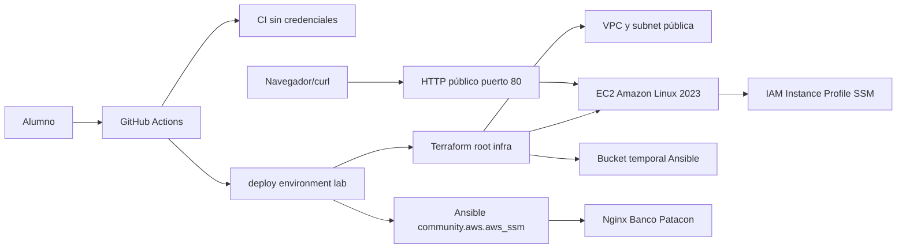

# M3-C4 LAB01 — CI/CD de infraestructura para Banco Patacon

**Módulo:** M3-C4 — Pipelines CI/CD con GitHub Actions
**Duración estimada:** 60 a 75 minutos
**Branch:** `m3-c4-lab`
**Environment de GitHub:** `lab`
**Región:** `us-east-1`

---

En este laboratorio vas a trabajar como parte del equipo cloud de **Banco Patacon**. El banco quiere que una infraestructura pequeña se valide automáticamente en cada cambio y que los despliegues manuales queden controlados por un environment de GitHub llamado `lab`.

El objetivo no es escribir Terraform desde cero. El objetivo es entender qué hace un pipeline de infraestructura, dónde falla cuando faltan credenciales, cómo se corrige la configuración, cómo se despliega y cómo se comprueba que no quedan cambios pendientes.

## Objetivos

- Ejecutar CI en `push` y `pull_request` sin credenciales AWS.
- Validar formato, inicialización local y sintaxis de Terraform y Ansible.
- Usar `workflow_dispatch` con `operation`: `plan`, `apply` o `destroy`.
- Configurar el environment `lab` con secrets y vars.
- Desplegar una EC2 Amazon Linux 2023 en una red pública mínima.
- Configurar Nginx por Ansible usando AWS Systems Manager Session Manager, sin SSH.
- Confirmar que un segundo plan no propone cambios.
- Limpiar la infraestructura del lab sin borrar el backend remoto.

## Arquitectura



## Alcance obligatorio

- Mantener un único root Terraform en `infra/`.
- Usar backend S3 preexistente configurado por CLI, con `use_lockfile=true`.
- Crear VPC, subnet pública, internet gateway, tabla de rutas, security group, IAM role/profile, bucket temporal privado y una única instancia EC2.
- Permitir sólo HTTP 80 de entrada en el security group.
- No usar SSH, key pair ni credenciales dentro del repositorio.
- Ejecutar Ansible por `community.aws.aws_ssm`.
- Ejecutar `destroy` al terminar.

## Alcance opcional

- Ajustar el texto visual de la página Banco Patacon.
- Agregar una regla de protección o aprobación manual al environment `lab`.
- Guardar capturas de los checks y del plan para la entrega.

## Prerrequisitos

- Repositorio personal en GitHub con Actions habilitado.
- Branch `m3-c4-lab` publicada siguiendo el README.
- `m3-c4-lab` seleccionada como default branch durante el lab.
- Branch abierta en Codespaces o en un entorno local equivalente.
- Terraform, AWS CLI, Ansible, Python y jq disponibles.
- Un bucket S3 de backend ya creado en la cuenta AWS del laboratorio.
- Credenciales AWS autorizadas para crear los recursos del lab.

No crees credenciales en archivos del repositorio. Usá secrets del environment de GitHub.

## Actividad 0 — Preparar y comprobar la branch

Desde tu repositorio personal:

```bash
git switch m3-c4-lab
git pull
git status
./scripts/validate-lab.sh
```

Si todavía no publicaste la branch:

```bash
git push -u origin m3-c4-lab
```

En GitHub:

1. Abrí **Settings → Branches**.
2. Confirmá que `m3-c4-lab` sea la default branch.
3. Abrí **Actions**.
4. Seleccioná **Infra CI/CD - Banco Patacon LAB01**.

**Por qué se hace así:** GitHub requiere que el workflow exista en la default branch para mostrar **Run workflow**. La ejecución manual ocurre en tu repositorio, donde administrás environments y secrets.

### Checkpoint 0

- `git branch --show-current` devuelve `m3-c4-lab`.
- `./scripts/validate-lab.sh` termina correctamente.
- GitHub muestra el workflow de infraestructura.

## Actividad 1 — Revisar el starter

1. Abrí el repositorio en la branch del laboratorio.
2. Revisá el mapa:

   ```bash
   ls
   ```

3. Leé estos archivos:
   - `.github/workflows/infra-ci.yml`
   - `infra/main.tf`
   - `ansible/playbook.yml`
   - `scripts/render_inventory.py`

4. Ejecutá la validación local:

   ```bash
   ./scripts/validate-lab.sh
   ```

Identificá en `.github/workflows/infra-ci.yml`:

- los triggers `push`, `pull_request` y `workflow_dispatch`;
- el job `ci`, que no usa secrets;
- el job `deploy`, que depende de CI mediante `needs`;
- el environment `lab`;
- las operaciones `plan`, `apply` y `destroy`.

**Por qué se revisa antes de ejecutar:** un workflow es código con permisos y efectos. Confirmá qué eventos lo activan y qué comandos ejecuta antes de entregarle credenciales.

## Actividad 2 — Observar el CI sin credenciales

1. Abrí el run generado por el push inicial de `m3-c4-lab`.
2. Entrá en el job **CI sin credenciales**.
3. Abrí cada step y revisá su salida.
4. Confirmá que el job `deploy` no se ejecutó durante el push.

Qué observar:

- `terraform init -backend=false` no necesita bucket ni credenciales.
- `terraform validate` revisa la configuración, pero no crea recursos.
- `ansible-playbook --syntax-check` revisa sintaxis, pero no se conecta a la instancia.

Checkpoint: el CI debe quedar en verde antes de ejecutar un despliegue manual.

**Por qué se hace así:** los cambios se validan antes de recibir permisos sobre AWS. Un push o pull request puede comprobar formato y sintaxis sin acceder a la cuenta cloud.

## Actividad 3 — Ejecutar el primer plan y ver el fallo esperado

1. Entrá en **Actions**.
2. Seleccioná el workflow **Infra CI/CD - Banco Patacon LAB01**.
3. Presioná **Run workflow**.
4. Elegí `operation = plan`.
5. Ejecutá el workflow.

Resultado esperado de la primera ejecución:

- El job `CI sin credenciales` termina correctamente.
- El job `deploy` usa el environment `lab`.
- Si el environment todavía no tiene credenciales, el workflow falla naturalmente en `aws-actions/configure-aws-credentials`.
- No hace falta agregar un step artificial para fallar.

Qué observar:

- El error indica que faltan `AWS_ACCESS_KEY_ID` y/o `AWS_SECRET_ACCESS_KEY`.
- El deploy depende de CI mediante `needs: ci`; una configuración inválida no llega a AWS.
- Todavía no se ejecuta Terraform contra AWS.

Guardá el enlace del run fallido. Es evidencia de que el pipeline no posee credenciales por defecto.

## Actividad 4 — Configurar el environment lab

En GitHub, abrí **Settings → Environments → New environment** y creá:

```text
lab
```

Agregá estos **Environment secrets**:

| Secret | Uso |
|---|---|
| `AWS_ACCESS_KEY_ID` | Access key del laboratorio |
| `AWS_SECRET_ACCESS_KEY` | Secret key del laboratorio |

Agregá estas **Environment variables**:

| Variable | Ejemplo | Uso |
|---|---|---|
| `AWS_REGION` | `us-east-1` | Región del laboratorio |
| `TF_STATE_BUCKET` | `mi-bucket-backend-tf` | Bucket S3 preexistente para state |
| `TF_STATE_KEY` | `formatec/m3-c4/lab01/tuusuario.tfstate` | Key del state remoto |
| `STUDENT_IDENTITY` | `tuusuario` | Identidad para nombrar recursos |

Regla para `STUDENT_IDENTITY`: usá sólo minúsculas, dígitos y guion. Ejemplos válidos: `ana`, `juan-01`, `equipo-7`.

No copies los valores de los secrets en capturas ni logs. GitHub no vuelve a mostrar su contenido después de guardarlos.

**Por qué se usa un environment:** concentra la configuración del destino `lab` y evita escribir datos sensibles en el YAML. El environment no despliega nada por sí mismo.

## Actividad 5 — Reintentar plan

1. Volvé al workflow fallido.
2. Presioná **Re-run jobs** o ejecutá un nuevo `workflow_dispatch` con `operation = plan`.
3. Revisá la salida de Terraform.

Qué observar:

- `terraform init` usa backend S3 con `use_lockfile=true`.
- `aws sts get-caller-identity` muestra la cuenta y la identidad usadas por el runner.
- `terraform plan` muestra los recursos a crear.
- Los nombres derivan de `STUDENT_IDENTITY` y del account id.

Checkpoint: el plan debe terminar en verde y no debe crear recursos todavía.

Antes del apply revisá:

- cuenta y ARN mostrados por STS;
- región `us-east-1`;
- key de state exclusiva para tu identidad;
- una sola instancia EC2;
- ingress HTTP 80 y ausencia de SSH 22;
- bucket temporal distinto del bucket de backend.

## Actividad 6 — Ejecutar apply y configurar Nginx

1. Ejecutá el workflow manual con `operation = apply`.
2. Revisá el plan antes de que se aplique.
3. Cuando termine Terraform, el workflow instala `session-manager-plugin`, Ansible y la colección `community.aws`.
4. El script `scripts/render_inventory.py` genera un inventario desde los outputs de Terraform.
5. Ansible se conecta por SSM y configura Nginx.
6. El workflow hace una comprobación HTTP pública.

Qué observar:

- No hay SSH ni key pair.
- La instancia usa `AmazonSSMManagedInstanceCore`.
- El bucket temporal de Ansible es privado y cifrado.
- El security group sólo permite HTTP 80 de entrada.

Checkpoint: la comprobación HTTP debe devolver la página Banco Patacon.

Abrí el step de Ansible y guardá el `PLAY RECAP`. Debe mostrar `failed=0` y `unreachable=0`.

**Por qué Terraform y Ansible están separados:** Terraform administra VPC, IAM, S3 y EC2. Ansible administra paquetes, archivos y servicios dentro de la instancia.

## Actividad 7 — Confirmar idempotencia de infraestructura

1. Ejecutá nuevamente `workflow_dispatch` con `operation = plan`.
2. Revisá la salida.

Resultado esperado:

```text
No changes. Your infrastructure matches the configuration.
```

Si aparecen cambios, revisá qué recurso cambió y si fue modificado fuera de Terraform.

**Por qué se repite:** un plan sin diferencias demuestra convergencia de infraestructura. No demuestra que Nginx responda; esa evidencia proviene del smoke test.

## Actividad 8 — Cleanup

1. Ejecutá `workflow_dispatch` con `operation = destroy`.
2. Verificá que Terraform elimine los recursos del target.
3. Confirmá que el bucket de backend remoto no se borra.

El destroy limpia los recursos declarados en `infra/`, incluido el bucket temporal usado por Ansible. El bucket S3 de backend no está declarado como recurso y debe quedar intacto.

Como el workflow crea un plan de destrucción y luego lo ejecuta con `terraform apply`, buscá en el log:

```text
Apply complete! Resources: 0 added, 0 changed, N destroyed.
```

Después del cleanup podés restaurar `main` como default branch de tu repositorio personal.

## Troubleshooting

### Falla en configure-aws-credentials

Revisá que el environment se llame exactamente `lab` y que tenga los secrets `AWS_ACCESS_KEY_ID` y `AWS_SECRET_ACCESS_KEY`.

### Terraform dice que el backend no existe

Revisá `TF_STATE_BUCKET`, `TF_STATE_KEY` y `AWS_REGION`. El bucket de backend debe existir antes del lab.

### STUDENT_IDENTITY no pasa la validación

Usá sólo letras minúsculas, números y guion. No uses espacios, mayúsculas, guion bajo ni puntos.

### Ansible no conecta por SSM

Esperá unos minutos después del apply. La instancia debe registrarse en Systems Manager. Revisá también que el role tenga `AmazonSSMManagedInstanceCore`.

### La comprobación HTTP falla

Esperá a que Nginx termine de iniciar y reintentá. Si sigue fallando, revisá el security group y la IP pública del output.

## Costos y cleanup

El lab crea recursos que pueden generar costo: una instancia EC2, almacenamiento EBS, tráfico y buckets S3. Ejecutá `destroy` al terminar y verificá que no queden recursos del prefijo del laboratorio.

No borres el bucket de backend compartido si fue provisto para el curso.

## Entregables

- Captura o enlace del CI en verde.
- Captura o enlace del primer `plan` fallando por credenciales faltantes.
- Captura o enlace del `plan` exitoso.
- Captura o enlace del `apply` exitoso con comprobación HTTP.
- Captura o enlace del segundo `plan` con `No changes`.
- Captura o enlace del `destroy` exitoso.
- Breve explicación de por qué CI no necesita credenciales y deploy sí.

## Rúbrica — 100 puntos

| Criterio | Puntos |
|---|---:|
| CI en push/PR sin credenciales ejecuta Terraform fmt/init/validate y Ansible syntax-check | 20 |
| Environment `lab` configurado correctamente con secrets y vars | 15 |
| Primer plan falla naturalmente por falta de credenciales antes de configurar secrets | 10 |
| Plan exitoso usa backend S3 preexistente con lockfile | 15 |
| Apply crea la arquitectura mínima solicitada sin SSH ni key pair | 15 |
| Ansible configura Nginx por SSM y la comprobación HTTP pasa | 15 |
| Segundo plan muestra `No changes` | 5 |
| Destroy limpia los recursos del lab y se presentan entregables claros | 5 |
