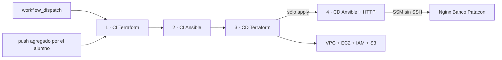

# M3-C4 LAB01 — CI/CD de infraestructura para Banco Patacon

**Módulo:** M3-C4 — Pipelines CI/CD con GitHub Actions
**Duración estimada:** 75 a 90 minutos
**Branch:** `m3-c4-lab`
**Environment de GitHub:** `lab`
**Región:** `us-east-1`

---

En este laboratorio vas a trabajar como parte del equipo cloud de **Banco Patacon**. El pipeline separa CI Terraform, CI Ansible, CD Terraform y CD Ansible para que puedas seguir visualmente cómo avanza cada operación. Al comienzo sólo se ejecuta de forma manual: tu trabajo será recuperar el deploy y agregar validación automática en cada push sin automatizar el despliegue.

El objetivo no es escribir Terraform desde cero. El objetivo es entender qué hace un pipeline de infraestructura, dónde falla cuando faltan credenciales, cómo se corrige la configuración, cómo se despliega y cómo se comprueba que no quedan cambios pendientes.

## Objetivos

- Distinguir los cuatro stages del pipeline: CI Terraform, CI Ansible, CD Terraform y CD Ansible.
- Agregar `on.push` para que la branch valide cambios sin credenciales AWS.
- Validar formato, inicialización local y sintaxis de Terraform y Ansible.
- Usar `workflow_dispatch` con `operation`: `plan`, `apply` o `destroy`.
- Configurar el environment `lab` con secrets y vars.
- Desplegar una EC2 Amazon Linux 2023 en una red pública mínima.
- Configurar Nginx por Ansible usando AWS Systems Manager Session Manager, sin SSH.
- Confirmar que un segundo plan no propone cambios.
- Limpiar la infraestructura del lab sin borrar el backend remoto.

## Arquitectura



En un push, `CD Terraform` y `CD Ansible` quedan omitidos porque ambos están condicionados a `workflow_dispatch`. El deploy nunca ocurre automáticamente.

## Alcance obligatorio

- Mantener un único root Terraform en `infra/`.
- Crear o reutilizar un backend S3 protegido y configurarlo por CLI con `use_lockfile=true`.
- Crear VPC, subnet pública, internet gateway, tabla de rutas, security group, IAM role/profile, bucket temporal privado y una única instancia EC2.
- Permitir sólo HTTP 80 de entrada en el security group.
- No usar SSH, key pair ni credenciales dentro del repositorio.
- Ejecutar Ansible por `community.aws.aws_ssm`.
- Conservar `plan`, `apply` y `destroy` como operaciones manuales.
- Agregar un trigger `push` limitado a `m3-c4-lab` para ejecutar solamente CI.
- Ejecutar `destroy` al terminar.

## Alcance opcional

- Ajustar el texto visual de la página Banco Patacon.
- Agregar una regla de protección o aprobación manual al environment `lab`.
- Guardar capturas de los checks y del plan para la entrega.

## Prerrequisitos

- Repositorio personal en GitHub con Actions habilitado.
- Branch `m3-c4-lab` publicada siguiendo el README.
- `m3-c4-lab` seleccionada como default branch durante el lab.
- Branch abierta en Codespaces o en un entorno local equivalente.
- Terraform, AWS CLI, Ansible, Python y jq disponibles.
- Permisos para crear o reutilizar un bucket S3 privado en la cuenta AWS del laboratorio.
- Credenciales AWS autorizadas para crear los recursos del lab.

No crees credenciales en archivos del repositorio. Usá secrets del environment de GitHub.

## Actividad 0 — Preparar y comprobar la branch

Desde tu repositorio personal:

```bash
git switch m3-c4-lab
git pull
git status
./scripts/validate-lab.sh
```

Si todavía no publicaste la branch:

```bash
git push -u origin m3-c4-lab
```

En GitHub:

1. Abrí **Settings → Branches**.
2. Confirmá que `m3-c4-lab` sea la default branch.
3. Abrí **Actions**.
4. Seleccioná **Infra CI/CD - Banco Patacon LAB01**.

**Por qué se hace así:** GitHub requiere que el workflow exista en la default branch para mostrar **Run workflow**. La ejecución manual ocurre en tu repositorio, donde administrás environments y secrets.

### Checkpoint 0

- `git branch --show-current` devuelve `m3-c4-lab`.
- `./scripts/validate-lab.sh` termina correctamente.
- GitHub muestra el workflow de infraestructura.

## Actividad 1 — Revisar el starter

1. Abrí el repositorio en la branch del laboratorio.
2. Revisá el mapa:

   ```bash
   ls
   ```

3. Leé estos archivos:
   - `.github/workflows/infra-ci.yml`
   - `infra/main.tf`
   - `ansible/playbook.yml`
   - `scripts/render_inventory.py`

4. Ejecutá la validación local:

   ```bash
   ./scripts/validate-lab.sh
   ```

Identificá en `.github/workflows/infra-ci.yml`:

- el único trigger inicial: `workflow_dispatch`;
- `ci-terraform`, con `fmt`, `init -backend=false` y `validate`;
- `ci-ansible`, con instalación de colecciones y `syntax-check`;
- `cd-terraform`, que depende de ambos jobs de CI;
- `cd-ansible`, que depende de CD Terraform y sólo se ejecuta durante `apply`;
- el environment `lab` usado por los dos jobs de CD;
- las operaciones manuales `plan`, `apply` y `destroy`.

Problema inicial: un cambio enviado por push no ejecuta ninguna validación. El workflow sólo puede iniciarse desde **Run workflow**.

**Por qué se revisa antes de ejecutar:** un workflow es código con permisos y efectos. Confirmá qué eventos lo activan y qué comandos ejecuta antes de entregarle credenciales.

## Actividad 2 — Ejecutar el pipeline manual y ver el fallo esperado

1. Entrá en **Actions**.
2. Seleccioná **Infra CI/CD - Banco Patacon LAB01**.
3. Presioná **Run workflow**.
4. Elegí `operation = plan`.
5. Ejecutá el workflow.

Seguí el grafo de jobs:

```text
1 · CI Terraform
→ 2 · CI Ansible
→ 3 · CD Terraform
```

Qué observar:

- CI Ansible comienza sólo cuando CI Terraform terminó correctamente.
- `terraform init -backend=false` no necesita bucket ni credenciales.
- `terraform validate` revisa la configuración, pero no crea recursos.
- `ansible-playbook --syntax-check` revisa sintaxis, pero no se conecta a la instancia.
- Ambos CI deben quedar en verde.
- CD Terraform comienza sólo después de completar la cadena CI Terraform → CI Ansible.
- Sin secrets, CD Terraform falla naturalmente en **Configure AWS credentials**.
- CD Ansible no se ejecuta porque la operación elegida fue `plan`.

Guardá el enlace del run. Debe mostrar con claridad que CI puede pasar sin acceso a AWS y que CD no puede usar la cuenta hasta configurar el environment.

### Checkpoint 2

- CI Terraform: verde.
- CI Ansible: verde.
- CD Terraform: rojo en credenciales.
- CD Ansible: omitido.

## Actividad 3 — Agregar CI automático en push

El deploy debe seguir siendo manual. Sólo vas a automatizar los dos stages de CI.

Editá el inicio de `.github/workflows/infra-ci.yml` y agregá `push` antes de `workflow_dispatch`:

```yaml
on:
  push:
    branches:
      - m3-c4-lab
    paths:
      - ".github/workflows/infra-ci.yml"
      - "infra/**"
      - "ansible/**"
      - "scripts/**"
  workflow_dispatch:
    inputs:
      operation:
        description: "Operación Terraform"
        required: true
        type: choice
        options:
          - plan
          - apply
          - destroy
```

Guardá y publicá el cambio:

```bash
git add .github/workflows/infra-ci.yml
git commit -m "Agregar CI automático para M3 C4"
git push
```

Abrí el run generado por el push. El grafo esperado es:

```text
1 · CI Terraform     verde
        ↓
2 · CI Ansible       verde
        ↓
3 · CD Terraform     omitido
        ↓
4 · CD Ansible       omitido
```

**Por qué:** los jobs de CD conservan `if: github.event_name == 'workflow_dispatch'`. Agregar `push` mejora el feedback de CI, pero no convierte el despliegue en automático.

### Checkpoint 3

- El push inicia el workflow.
- Los dos stages de CI pasan sin secrets.
- Ningún stage de CD accede a AWS.

## Actividad 4 — Crear y verificar el backend S3

El backend debe existir antes de que el workflow ejecute `terraform init`. No puede ser creado por el mismo root Terraform que intenta guardar su state dentro de ese bucket.

Desde Codespaces, CloudShell o una terminal con las credenciales autorizadas del laboratorio:

```bash
export AWS_REGION="us-east-1"
export STUDENT_IDENTITY="tuusuario"

ACCOUNT_ID=$(aws sts get-caller-identity --query Account --output text)
export TF_STATE_BUCKET="formatec-tfstate-${ACCOUNT_ID}-${STUDENT_IDENTITY}"

echo "Cuenta: $ACCOUNT_ID"
echo "Región: $AWS_REGION"
echo "Bucket backend: $TF_STATE_BUCKET"
```

Reemplazá `tuusuario` por la misma identidad que usarás en `STUDENT_IDENTITY`. Usá sólo minúsculas, números y guion.

Comprobá si el bucket ya existe en tu cuenta:

```bash
if aws s3api head-bucket --bucket "$TF_STATE_BUCKET" 2>/dev/null; then
  echo "El bucket ya existe"
else
  aws s3api create-bucket \
    --bucket "$TF_STATE_BUCKET" \
    --region "$AWS_REGION"
fi
```

El comando anterior corresponde a `us-east-1`, la región definida para el laboratorio.

Protegé el backend:

```bash
aws s3api put-bucket-versioning \
  --bucket "$TF_STATE_BUCKET" \
  --versioning-configuration Status=Enabled

aws s3api put-bucket-encryption \
  --bucket "$TF_STATE_BUCKET" \
  --server-side-encryption-configuration \
  '{"Rules":[{"ApplyServerSideEncryptionByDefault":{"SSEAlgorithm":"AES256"}}]}'

aws s3api put-public-access-block \
  --bucket "$TF_STATE_BUCKET" \
  --public-access-block-configuration \
  BlockPublicAcls=true,IgnorePublicAcls=true,BlockPublicPolicy=true,RestrictPublicBuckets=true
```

Verificá la configuración:

```bash
aws s3api get-bucket-versioning --bucket "$TF_STATE_BUCKET"
aws s3api get-bucket-encryption --bucket "$TF_STATE_BUCKET"
aws s3api get-public-access-block --bucket "$TF_STATE_BUCKET"
```

Resultado esperado:

- versionado `Enabled`;
- cifrado `AES256`;
- las cuatro opciones de acceso público en `true`.

Guardá el valor mostrado por:

```bash
echo "$TF_STATE_BUCKET"
```

Lo usarás como variable `TF_STATE_BUCKET` del environment `lab`.

Este laboratorio usa locking nativo de S3 mediante:

```text
use_lockfile=true
```

No crees una tabla DynamoDB ni agregues `dynamodb_table`: no forma parte del backend de este starter.

### Checkpoint 4

- La identidad STS corresponde a la cuenta autorizada.
- El bucket existe en `us-east-1`.
- Versionado, cifrado y bloqueo de acceso público están activos.
- El nombre exacto del bucket está guardado para GitHub.

## Actividad 5 — Configurar el environment lab

En GitHub, abrí **Settings → Environments → New environment** y creá:

```text
lab
```

Agregá estos **Environment secrets**:

| Secret | Uso |
|---|---|
| `AWS_ACCESS_KEY_ID` | Access key del laboratorio |
| `AWS_SECRET_ACCESS_KEY` | Secret key del laboratorio |

Agregá estas **Environment variables**:

| Variable | Ejemplo | Uso |
|---|---|---|
| `AWS_REGION` | `us-east-1` | Región del laboratorio |
| `TF_STATE_BUCKET` | `mi-bucket-backend-tf` | Bucket S3 preexistente para state |
| `TF_STATE_KEY` | `formatec/m3-c4/lab01/tuusuario.tfstate` | Key del state remoto |
| `STUDENT_IDENTITY` | `tuusuario` | Identidad para nombrar recursos |

Regla para `STUDENT_IDENTITY`: usá sólo minúsculas, dígitos y guion. Ejemplos válidos: `ana`, `juan-01`, `equipo-7`.

No copies los valores de los secrets en capturas ni logs. GitHub no vuelve a mostrar su contenido después de guardarlos.

**Por qué se usa un environment:** concentra la configuración del destino `lab` y evita escribir datos sensibles en el YAML. El environment no despliega nada por sí mismo.

## Actividad 6 — Reintentar plan

1. Volvé al workflow fallido.
2. Presioná **Re-run jobs** o ejecutá un nuevo `workflow_dispatch` con `operation = plan`.
3. Revisá el grafo y el step **Terraform plan** dentro de `3 · CD Terraform`.

Qué observar:

- `terraform init` usa backend S3 con `use_lockfile=true`.
- `aws sts get-caller-identity` muestra la cuenta y la identidad usadas por el runner.
- `terraform plan` muestra los recursos a crear.
- Los nombres derivan de `STUDENT_IDENTITY` y del account id.

Checkpoint: el plan debe terminar en verde y no debe crear recursos todavía.

`4 · CD Ansible + HTTP` debe quedar omitido: un plan no crea una instancia para configurar.

Antes del apply revisá:

- cuenta y ARN mostrados por STS;
- región `us-east-1`;
- key de state exclusiva para tu identidad;
- una sola instancia EC2;
- ingress HTTP 80 y ausencia de SSH 22;
- bucket temporal distinto del bucket de backend.

## Actividad 7 — Ejecutar apply y configurar Nginx

1. Ejecutá el workflow manual con `operation = apply`.
2. Observá la secuencia: CI Terraform termina, luego CI Ansible y recién después comienza CD Terraform.
3. En `3 · CD Terraform`, revisá **3.6 · Terraform plan previo al deploy** y **3.7 · Terraform deploy**.
4. Cuando CD Terraform termina, comienza `4 · CD Ansible + HTTP` en un runner nuevo.
5. CD Ansible vuelve a inicializar el backend para leer los outputs del state remoto.
6. Instala `session-manager-plugin`, Ansible y la colección `community.aws`.
7. `scripts/render_inventory.py` genera un inventario desde los outputs de Terraform.
8. Ansible se conecta por SSM y configura Nginx.
9. El último step hace una comprobación HTTP pública.

Grafo esperado:

```text
1 · CI Terraform
→ 2 · CI Ansible
→ 3 · CD Terraform
→ 4 · CD Ansible + HTTP
```

Qué observar:

- No hay SSH ni key pair.
- La instancia usa `AmazonSSMManagedInstanceCore`.
- El bucket temporal de Ansible es privado y cifrado.
- El security group sólo permite HTTP 80 de entrada.

Checkpoint: la comprobación HTTP debe devolver la página Banco Patacon.

Abrí el step de Ansible y guardá el `PLAY RECAP`. Debe mostrar `failed=0` y `unreachable=0`.

**Por qué Terraform y Ansible están separados:** Terraform administra VPC, IAM, S3 y EC2. Ansible administra paquetes, archivos y servicios dentro de la instancia.

**Por qué CD Ansible vuelve a inicializar Terraform:** cada job usa un runner efímero diferente. El segundo runner no recibe el directorio `.terraform` ni los outputs del anterior; reconstruye el contexto leyendo el mismo backend remoto.

## Actividad 8 — Confirmar idempotencia de infraestructura

1. Ejecutá nuevamente `workflow_dispatch` con `operation = plan`.
2. Revisá el step **Terraform plan** en `3 · CD Terraform`.
3. Confirmá que CD Ansible quede omitido.

Resultado esperado:

```text
No changes. Your infrastructure matches the configuration.
```

Si aparecen cambios, revisá qué recurso cambió y si fue modificado fuera de Terraform.

**Por qué se repite:** un plan sin diferencias demuestra convergencia de infraestructura. No demuestra que Nginx responda; esa evidencia proviene del smoke test.

## Actividad 9 — Cleanup

1. Ejecutá `workflow_dispatch` con `operation = destroy`.
2. Verificá que los steps **3.6 · Terraform plan para destroy** y **3.7 · Terraform destroy** eliminen los recursos del target.
3. Confirmá que `4 · CD Ansible + HTTP` quede omitido.
4. Confirmá que el bucket de backend remoto no se borra.

El destroy limpia los recursos declarados en `infra/`, incluido el bucket temporal usado por Ansible. El bucket S3 de backend no está declarado como recurso y debe quedar intacto.

Como el workflow crea un plan de destrucción y luego lo ejecuta con `terraform apply`, buscá en el log:

```text
Apply complete! Resources: 0 added, 0 changed, N destroyed.
```

Después del cleanup podés restaurar `main` como default branch de tu repositorio personal.

## Troubleshooting

### Falla en configure-aws-credentials

Revisá que el environment se llame exactamente `lab` y que tenga los secrets `AWS_ACCESS_KEY_ID` y `AWS_SECRET_ACCESS_KEY`.

### Terraform dice que el backend no existe

Revisá `TF_STATE_BUCKET`, `TF_STATE_KEY` y `AWS_REGION`. Repetí la verificación de la Actividad 4 y confirmá que el nombre guardado en GitHub coincide exactamente con `echo "$TF_STATE_BUCKET"`.

### Terraform intenta usar DynamoDB

El starter actual usa `use_lockfile=true` y no requiere tabla DynamoDB. Revisá que tu branch y workflow estén actualizados y que no exista una configuración heredada con `dynamodb_table`. Si cambió la configuración del backend, reinicializá con `terraform init -reconfigure` en un entorno controlado antes de reintentar.

### STUDENT_IDENTITY no pasa la validación

Usá sólo letras minúsculas, números y guion. No uses espacios, mayúsculas, guion bajo ni puntos.

### Ansible no conecta por SSM

Esperá unos minutos después del apply. La instancia debe registrarse en Systems Manager. Revisá también que el role tenga `AmazonSSMManagedInstanceCore`.

### La comprobación HTTP falla

Esperá a que Nginx termine de iniciar y reintentá. Si sigue fallando, revisá el security group y la IP pública del output.

## Costos y cleanup

El lab crea recursos que pueden generar costo: una instancia EC2, almacenamiento EBS, tráfico y buckets S3. Ejecutá `destroy` al terminar y verificá que no queden recursos del prefijo del laboratorio.

No borres el bucket de backend durante el cleanup de LAB01. Es infraestructura previa al root `infra/` y puede conservar versiones del state. Su eliminación, si corresponde, se realiza por separado al terminar el curso.

## Entregables

- Salida o captura de la verificación del backend con versionado, cifrado y bloqueo de acceso público activos, sin exponer credenciales.
- Captura o enlace del CI en verde.
- Commit donde agregaste `on.push` para `m3-c4-lab`.
- Captura del push ejecutando CI Terraform y CI Ansible con ambos stages de CD omitidos.
- Captura o enlace del primer `plan` fallando por credenciales faltantes.
- Captura o enlace del `plan` exitoso.
- Captura o enlace del `apply` exitoso con comprobación HTTP.
- Captura o enlace del segundo `plan` con `No changes`.
- Captura o enlace del `destroy` exitoso.
- Breve explicación de por qué CI no necesita credenciales y deploy sí.

## Rúbrica — 100 puntos

| Criterio | Puntos |
|---|---:|
| Agrega `on.push` para `m3-c4-lab`; CI Terraform y CI Ansible pasan sin activar CD | 20 |
| Environment `lab` configurado correctamente con secrets y vars | 15 |
| Primer plan falla naturalmente por falta de credenciales antes de configurar secrets | 10 |
| Crea o verifica el backend S3 protegido y el plan usa locking nativo con `use_lockfile=true` | 15 |
| Apply crea la arquitectura mínima solicitada sin SSH ni key pair | 15 |
| CD Ansible corre como stage separado, configura Nginx por SSM y HTTP pasa | 15 |
| Segundo plan muestra `No changes` | 5 |
| Destroy limpia los recursos del lab y se presentan entregables claros | 5 |
