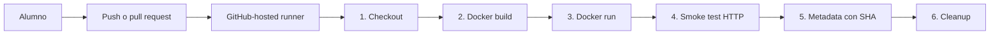

# M3-C4 LAB02 — Pipeline de una imagen Docker para Banco Patacon

**Módulo:** M3-C4 — Pipelines CI/CD con GitHub Actions
**Duración estimada:** 45 a 60 minutos
**Branch:** `m3-c4-lab`
**Dependencia:** LAB01 completado y cleanup confirmado

---

En este laboratorio vas a construir desde cero una imagen Docker pequeña y el workflow que la valida. Banco Patacon necesita publicar una página de estado para informar si su canal de transferencias está disponible.

El equipo ya puede construir imágenes manualmente, pero cada integrante ejecuta comandos diferentes. Algunas imágenes llegan sin prueba HTTP, con tags ambiguos o sin relación visible con el commit que las originó.

El pipeline debe ejecutar siempre el mismo recorrido:

```text
checkout
→ verificar Docker
→ construir imagen
→ iniciar contenedor
→ ejecutar smoke test HTTP
→ registrar metadata
→ limpiar el runner
```

## Objetivos

- Crear desde cero una aplicación web estática mínima.
- Escribir un Dockerfile reproducible.
- Construir y probar la imagen localmente.
- Crear un workflow de GitHub Actions sin credenciales externas.
- Comprender por qué el orden de los steps afecta al resultado.
- Relacionar la imagen con el SHA del commit.
- Distinguir construcción, publicación y despliegue.

## Arquitectura del lab



La imagen se construye dentro de un runner temporal de GitHub. Cuando termina el job, la imagen desaparece. En este lab no se publica en GHCR ni ECR y no se despliega en AWS.

## Alcance obligatorio

Vas a crear:

```text
app/
├── .dockerignore
├── Dockerfile
└── index.html
.github/workflows/
└── image-ci.yml
```

El pipeline debe:

- ejecutarse en `push` y `pull_request`;
- construir una imagen con un tag basado en `github.sha`;
- iniciar un contenedor;
- verificar HTTP con `curl`;
- generar metadata de la imagen;
- subir esa metadata como artifact;
- mostrar logs si algo falla;
- limpiar el contenedor al finalizar.

## Fuera de alcance

En este lab no vas a:

- publicar imágenes en GHCR o ECR;
- usar credenciales AWS;
- desplegar la imagen en EC2;
- promover entre dev y prod;
- usar Docker Compose, Kubernetes o ECS;
- construir una aplicación con framework frontend.

## Prerrequisitos

- Branch `m3-c4-lab` en tu repositorio.
- GitHub Actions habilitado.
- Docker disponible localmente o en Codespaces.
- LAB01 conservado en la misma branch.
- Infraestructura AWS de LAB01 eliminada mediante `destroy`.

Verificá el entorno:

```bash
git branch --show-current
docker version
git status
```

## Actividad 0 — Actualizar y verificar el entorno

Desde tu repositorio personal:

```bash
git switch m3-c4-lab
git pull
git status
```

Si usás Codespaces y Docker todavía no aparece:

1. Abrí la paleta con `Ctrl+Shift+P`.
2. Ejecutá **Codespaces: Rebuild Container**.
3. Esperá a que termine la reconstrucción.
4. Volvé a ejecutar:

```bash
docker version
```

No debe existir una solución previa de LAB02:

```bash
test ! -d app && echo "app se creará desde cero"
test ! -f .github/workflows/image-ci.yml && echo "workflow se creará desde cero"
```

**Por qué se hace así:** LAB02 evalúa la construcción del contexto Docker y del workflow. Empezar sin esos archivos permite observar qué aporta cada uno.

### Checkpoint 0

- Branch `m3-c4-lab` activa.
- Worktree sin cambios pendientes.
- Cliente y daemon Docker disponibles.
- LAB01 destruido antes de continuar.

## Actividad 1 — Definir la necesidad del pipeline
Antes de crear archivos, respondé:

1. ¿Qué podría olvidar una persona que construye la imagen manualmente?
2. ¿Cómo se demuestra qué commit originó una imagen?
3. ¿Qué diferencia hay entre construir una imagen y desplegarla?
4. ¿Qué debería ocurrir si la imagen construye pero no responde HTTP?

Registrá las respuestas en tu entrega.

## Actividad 2 — Crear la página desde cero

Creá la carpeta:

```bash
mkdir -p app
```

Creá `app/index.html`:

```html
<!doctype html>
<html lang="es">
  <head>
    <meta charset="utf-8">
    <meta name="viewport" content="width=device-width, initial-scale=1">
    <title>Banco Patacon</title>
  </head>
  <body>
    <main>
      <h1>Banco Patacon</h1>
      <p>Canal de transferencias disponible.</p>
    </main>
  </body>
</html>
```

Checkpoint:

```bash
test -f app/index.html && echo "index.html OK"
```

## Actividad 3 — Crear el Dockerfile

Creá `app/Dockerfile`:

```dockerfile
FROM nginx:1.27-alpine

ARG APP_VERSION=dev

LABEL org.opencontainers.image.title="banco-patacon-status"
LABEL org.opencontainers.image.revision="${APP_VERSION}"

COPY index.html /usr/share/nginx/html/index.html

EXPOSE 80

HEALTHCHECK --interval=10s --timeout=3s --retries=3 \
  CMD wget -qO- http://127.0.0.1/ >/dev/null || exit 1
```

Creá `app/.dockerignore`:

```text
.git
.github
*.log
```

Qué representa cada instrucción:

- `FROM` selecciona la base de ejecución.
- `ARG` recibe el identificador de la versión durante el build.
- `LABEL` conserva trazabilidad dentro de la imagen.
- `COPY` agrega el contenido producido por el equipo.
- `EXPOSE` documenta el puerto esperado.
- `HEALTHCHECK` prueba el proceso dentro del contenedor.

## Actividad 4 — Construir y probar localmente

Construí la imagen:

```bash
docker build \
  --build-arg APP_VERSION=local \
  --tag banco-patacon-status:local \
  app
```

Iniciá el contenedor:

```bash
docker run --detach \
  --name banco-patacon-status-local \
  --publish 8080:80 \
  banco-patacon-status:local
```

Probá HTTP:

```bash
curl --fail http://127.0.0.1:8080/
```

Revisá la trazabilidad:

```bash
docker image inspect banco-patacon-status:local \
  --format '{{ index .Config.Labels "org.opencontainers.image.revision" }}'
```

La salida esperada es:

```text
local
```

Limpiá el contenedor local:

```bash
docker rm --force banco-patacon-status-local
```

## Actividad 5 — Crear el workflow comentado

Creá `.github/workflows/image-ci.yml` con este contenido. Los comentarios `Orden` explican por qué cada step aparece en esa posición.

```yaml
name: Image CI - Banco Patacon LAB02

on:
  push:
    paths:
      - "app/**"
      - ".github/workflows/image-ci.yml"
  pull_request:
    paths:
      - "app/**"
      - ".github/workflows/image-ci.yml"
  workflow_dispatch:

permissions:
  contents: read

concurrency:
  group: image-lab02-${{ github.ref }}
  cancel-in-progress: true

jobs:
  build-and-test:
    name: Construir y probar imagen
    runs-on: ubuntu-latest
    timeout-minutes: 10

    steps:
      # Orden 1: el runner comienza vacío; primero necesita descargar el repositorio.
      - name: 1. Descargar repositorio
        uses: actions/checkout@v7

      # Orden 2: confirmamos qué herramienta ejecutará el build antes de usarla.
      - name: 2. Verificar Docker
        run: docker version

      # Orden 3: construimos una imagen trazable con el SHA exacto del commit.
      - name: 3. Construir imagen
        run: |
          docker build \
            --build-arg APP_VERSION=${{ github.sha }} \
            --tag banco-patacon-status:${{ github.sha }} \
            app

      # Orden 4: sólo podemos iniciar el contenedor si el build anterior terminó bien.
      - name: 4. Iniciar contenedor
        run: |
          docker run --detach \
            --name banco-patacon-status-ci \
            --publish 8080:80 \
            banco-patacon-status:${{ github.sha }}

      # Orden 5: comprobamos el comportamiento observable, no sólo que exista la imagen.
      - name: 5. Ejecutar smoke test HTTP
        run: |
          for attempt in {1..10}; do
            if curl --fail --silent http://127.0.0.1:8080/ | grep --quiet "Banco Patacon"; then
              echo "Smoke test correcto"
              exit 0
            fi
            echo "Intento ${attempt}/10"
            sleep 2
          done
          echo "La aplicación no respondió correctamente" >&2
          exit 1

      # Orden 6: después del smoke test registramos qué imagen fue validada.
      - name: 6. Generar metadata
        run: |
          {
            echo "repository=${{ github.repository }}"
            echo "commit=${{ github.sha }}"
            echo "image=banco-patacon-status:${{ github.sha }}"
            echo -n "label_revision="
            docker image inspect banco-patacon-status:${{ github.sha }} \
              --format '{{ index .Config.Labels "org.opencontainers.image.revision" }}'
          } > image-metadata.txt
          cat image-metadata.txt

      # Orden 7: guardamos evidencia pequeña; no subimos la imagen Docker completa.
      - name: 7. Publicar metadata como artifact
        uses: actions/upload-artifact@v7
        with:
          name: image-metadata-${{ github.sha }}
          path: image-metadata.txt
          retention-days: 3

      # Orden 8: si un step anterior falla, los logs ayudan a diagnosticar el contenedor.
      - name: 8. Mostrar logs si falla
        if: failure()
        run: docker logs banco-patacon-status-ci || true

      # Orden 9: always() garantiza la limpieza tanto en éxito como en fallo.
      - name: 9. Limpiar runner
        if: always()
        run: docker rm --force banco-patacon-status-ci || true
```

## Actividad 6 — Ejecutar el pipeline

Guardá los archivos:

```bash
git add app .github/workflows/image-ci.yml
git commit -m "Agregar pipeline de imagen Docker"
git push
```

En GitHub:

1. Abrí **Actions**.
2. Seleccioná **Image CI - Banco Patacon LAB02**.
3. Abrí el run asociado a tu commit.
4. Revisá los nueve steps en orden.
5. Descargá el artifact `image-metadata-<SHA>`.
6. Compará el campo `commit` con el SHA mostrado por GitHub.

Checkpoint: el workflow debe terminar en verde y la metadata debe contener el mismo SHA del run.

## Actividad 7 — Observar un fallo controlado

Modificá temporalmente `app/Dockerfile`:

```dockerfile
COPY home.html /usr/share/nginx/html/index.html
```

No crees `home.html`. Hacé commit y push.

Qué debe ocurrir:

- el step `3. Construir imagen` falla;
- no se ejecutan los steps normales que dependen del build;
- el artifact no se publica;
- el step de limpieza se ejecuta por `always()`.

Corregí nuevamente la instrucción:

```dockerfile
COPY index.html /usr/share/nginx/html/index.html
```

Hacé otro commit y confirmá que el pipeline vuelve a verde.

No elimines la validación para obtener un resultado exitoso: corregí la causa del fallo.

## Actividad 8 — Interpretar el resultado

Respondé:

1. ¿Por qué el checkout debe ejecutarse antes de `docker build`?
2. ¿Qué prueba el build y qué prueba el smoke test?
3. ¿Por qué la imagen usa el SHA y no solamente `latest`?
4. ¿Por qué el artifact contiene metadata y no la imagen completa?
5. ¿Dónde queda la imagen cuando termina el runner?
6. ¿Qué step agregarías después para publicar en un registry?

## Troubleshooting

### `docker: command not found`

En Codespaces ejecutá **Codespaces: Rebuild Container** y verificá que estés en `m3-c4-lab`.

### `Cannot connect to the Docker daemon`

Esperá a que termine la inicialización del Codespace. Luego ejecutá:

```bash
docker version
```

Si sólo aparece información del cliente, reconstruí el contenedor.

### El puerto 8080 está ocupado

Eliminá el contenedor anterior:

```bash
docker rm --force banco-patacon-status-local
```

### El smoke test falla

Revisá:

```bash
docker logs banco-patacon-status-local
docker ps --all
curl --verbose http://127.0.0.1:8080/
```

### El workflow no aparece

Verificá que el archivo esté exactamente en:

```text
.github/workflows/image-ci.yml
```

También verificá que el commit esté publicado en GitHub.

## Costos y limpieza

El recorrido obligatorio usa GitHub-hosted runners y Docker local/Codespaces. No crea recursos AWS.

Al terminar localmente:

```bash
docker rm --force banco-patacon-status-local 2>/dev/null || true
docker image rm banco-patacon-status:local 2>/dev/null || true
```

Detené el Codespace cuando no lo uses para evitar consumo innecesario de cuota.

## Entregables

- `app/index.html`.
- `app/Dockerfile`.
- `app/.dockerignore`.
- `.github/workflows/image-ci.yml` con comentarios de orden.
- Enlace al primer workflow exitoso.
- Evidencia del fallo controlado y de su corrección.
- Artifact de metadata vinculado al SHA.
- Respuestas de la Actividad 8.

## Rúbrica — 100 puntos

| Criterio | Puntos |
|---|---:|
| Página, Dockerfile y `.dockerignore` creados desde cero | 15 |
| Imagen construye y responde HTTP localmente | 15 |
| Workflow usa triggers, permisos y concurrencia adecuados | 15 |
| Steps están ordenados y comentados de forma coherente | 15 |
| Build usa el SHA del commit como identificador | 10 |
| Contenedor y smoke test se ejecutan correctamente en GitHub Actions | 15 |
| Metadata se publica y coincide con el SHA | 5 |
| Fallo controlado, diagnóstico y corrección | 5 |
| Respuestas distinguen build, publicación y deploy | 5 |
