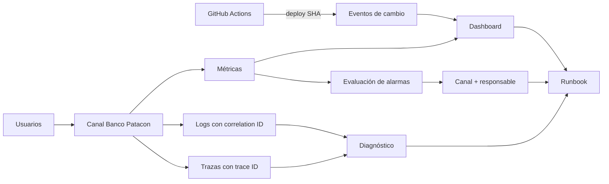

# M3-C5 LAB01 — Monitoreo proactivo de Banco Patacon

**Módulo:** M3-C5 — Monitoreo proactivo
**Duración estimada:** 35 minutos
**Branch:** `m3-c5-lab`
**Implementación AWS:** opcional

---

## Contexto

En M3-C4 LAB01, el run de `apply` desplegó infraestructura, ejecutó Ansible y comprobó HTTP. Ese resultado demostró que el servicio respondía al finalizar el pipeline. No garantizaba su comportamiento durante las horas siguientes.

Para esta continuación narrativa, Banco Patacon registra una degradación posterior en el canal de transferencias. El equipo dispone de métricas agregadas y eventos reales de cambio, pero todavía debe decidir qué medir, qué objetivo proteger y cuándo actuar.

Tu misión es convertir esos datos en un modelo de monitoreo accionable. El incidente no proviene del pipeline de imagen de M3-C4 LAB02: esa imagen fue construida y probada, pero no desplegada.

## Objetivos

- Interpretar tasa de errores, latencia p95 y saturación.
- Distinguir señales de impacto, recursos y cambios.
- Definir dos SLI/SLO medibles con limitaciones explícitas.
- Diseñar un dashboard de tres paneles orientado a decisiones.
- Proponer dos alertas con evaluación, responsable y recuperación.
- Separar evidencia, hipótesis y causa raíz.

## Arquitectura de observabilidad objetivo



Una alarma evalúa una condición y cambia de estado. Una alerta operativa agrega canal, routing, responsable y runbook. Tener logs y trazas tampoco garantiza correlación: la aplicación debe propagar identificadores entre servicios y controlar sampling, retención y cardinalidad.

## Alcance obligatorio

- Analizar `datos/incidente-banco-patacon.csv`.
- Completar una copia de `plantillas/matriz-sli-slo-alertas.md`.
- Calcular tasa 5xx para tres intervalos: antes, durante y después del pico.
- Definir dos SLI/SLO.
- Diseñar exactamente tres paneles.
- Definir exactamente dos alertas: una de impacto y una técnica.
- Escribir un runbook de cinco pasos.
- Concluir sin afirmar una causa no demostrada.

## Extensión opcional AWS

La extensión es una práctica de navegación y estados de CloudWatch. Requiere una EC2 de demostración previamente autorizada; no presupone que conservaste recursos de M3-C4, cuyo cleanup era obligatorio.

Permite crear:

- un dashboard con `CPUUtilization` y `StatusCheckFailed`;
- dos alarmas técnicas sin canal de notificación;
- nombres con prefijo personal;
- cleanup de dashboard y alarmas.

No implementa las alertas de impacto diseñadas en el recorrido obligatorio. Para eso harían falta métricas de aplicación, ALB o pruebas sintéticas, más un canal y un responsable.

## Prerrequisitos

- Git y Python 3.
- Branch `m3-c5-lab`.
- Editor o planilla capaz de abrir CSV.
- Sin credenciales AWS para el recorrido obligatorio.
- Para la extensión: cuenta, región, instancia y permisos CloudWatch autorizados.

## Actividad 0 — Preparar el material — 3 minutos

```bash
git branch --show-current
python3 scripts/validate-materials.py
mkdir -p entregables
cp plantillas/matriz-sli-slo-alertas.md entregables/monitoreo-banco-patacon.md
```

Resultado esperado:

```text
m3-c5-lab
OK: materiales M3-C5 validados
```

### Checkpoint 0

- Branch correcta.
- Dataset con 12 ventanas.
- Copia de la matriz creada.

## Actividad 1 — Leer las señales — 7 minutos

Abrí:

```text
datos/incidente-banco-patacon.csv
```

Cada fila representa una ventana de cinco minutos `[window_start_utc, window_start_utc + 5 minutos)` en UTC:

| Campo | Semántica |
|---|---|
| `requests` | suma de solicitudes de la ventana |
| `http_5xx` | suma de respuestas 5xx de la ventana |
| `latency_p95_ms` | p95 de todas las respuestas observadas en esa ventana |
| `cpu_avg_percent` | CPU promedio de la ventana |
| `memory_avg_percent` | memoria promedio de la ventana |
| `change_event` | deploy o rollback registrado; vacío si no hubo cambio |

Calculá para tres intervalos —antes, durante y después del pico—:

```text
tasa_5xx = http_5xx / requests × 100
```

Identificá:

- último intervalo estable;
- primer intervalo degradado;
- pico;
- primer intervalo cercano al baseline después de la mitigación.

Registrá los resultados en la sección 5 de la matriz.

### Checkpoint 1

La tasa de 09:30 debe ser aproximadamente:

```text
19,37%
```

Separá:

- **evidencia:** valores del dataset;
- **hipótesis:** explicación compatible;
- **causa raíz:** explicación confirmada con evidencia adicional.

El deploy y la degradación están correlacionados temporalmente. El CSV no demuestra causalidad.

## Actividad 2 — Definir dos SLI/SLO — 8 minutos

Completá la sección 2 de la matriz.

### SLI 1 — Tasa de errores de servidor

```text
http_5xx / requests × 100
```

Este indicador mide errores 5xx observados por la aplicación. No equivale a disponibilidad externa ni a éxito de negocio:

- no observa solicitudes que no llegaron por DNS, red o timeout;
- no distingue operaciones funcionalmente incorrectas con respuesta 2xx;
- no convierte automáticamente todos los 4xx en fallas del servicio.

Definí servicio, ambiente, población, exclusiones, fuente, SLO y ventana.

### SLI 2 — Cumplimiento de latencia p95 por intervalo

```text
intervalos con latency_p95_ms <= N / total de intervalos evaluados
```

Definí `N`, SLO y ventana. Aclaración:

> No promedies percentiles para construir otro percentil. El promedio de varios p95 no es el p95 del período completo.

El CSV no permite calcular “porcentaje de requests debajo de N ms”; para eso se necesitan histogramas, buckets o conteos bajo el umbral.

### Señal faltante

Proponé una señal adicional para disponibilidad externa o éxito funcional, por ejemplo:

- probe HTTP externo;
- operación sintética de transferencia;
- métrica de transferencias completadas.

No la calcules con datos que el dataset no contiene.

### Checkpoint 2

Cada SLI debe especificar:

- fórmula;
- servicio, ambiente y población;
- SLO y ventana;
- fuente;
- exclusiones y datos faltantes;
- limitación.

## Actividad 3 — Diseñar tres paneles — 7 minutos

Completá la sección 3 de la matriz con exactamente tres paneles:

1. impacto: tasa 5xx y volumen de requests;
2. experiencia: latencia p95;
3. saturación: CPU y memoria.

Marcá deploy y rollback como anotaciones o eventos. Para cada panel indicá:

- visualización y unidad;
- período y estadística;
- pregunta operativa;
- segmentación por ambiente, servicio o endpoint.

No uses el dashboard para declarar una causa. Usalo para detectar, acotar y correlacionar.

### Checkpoint 3

- Los conteos usan `Sum` cuando corresponda.
- CPU y memoria están identificadas como promedios del intervalo.
- Cada panel responde una pregunta.
- Los cambios están visibles junto a las señales.

## Actividad 4 — Diseñar dos alertas — 7 minutos

Completá la sección 4.

### Alerta 1 — Impacto al usuario

Diseñá una condición sobre tasa 5xx o latencia. Incluí volumen mínimo o una regla para períodos sin tráfico.

Una condición como:

```text
5xx > 5% durante 10 minutos y al menos 100 requests
```

es conceptual. En CloudWatch requeriría series alineadas, conteos con `Sum`, metric math para `100 × errors / requests`, tratamiento de división por cero y posiblemente una composite alarm o expresión condicional para el volumen mínimo.

### Alerta 2 — Riesgo técnico

Diseñá una condición de saturación o status check. Explicá por qué es una causa posible y no una prueba directa de impacto.

Para ambas definí:

- condición y ventana;
- períodos evaluados y datapoints necesarios;
- tratamiento de datos faltantes;
- severidad;
- responsable y acción;
- falso positivo;
- condición de recuperación.

### Checkpoint 4

Si nadie sabe qué hacer cuando se dispara, todavía no es una alerta operativa útil.

## Actividad 5 — Runbook y cierre — 3 minutos

Completá cinco pasos:

1. confirmar la señal y la calidad de datos;
2. acotar usuarios, endpoints y ambientes;
3. correlacionar cambios y revisar logs/trazas;
4. mitigar o revertir y verificar recuperación;
5. preservar evidencia y registrar acciones posteriores.

Cerrá con un texto de hasta 120 palabras:

- qué alerta implementarías primero;
- qué señal falta;
- por qué el dataset no prueba causa raíz.

## Actividad 6 — Extensión opcional en CloudWatch

No realices esta actividad sin autorización y una EC2 de demostración activa.

### Seguridad y nombres

1. Verificá cuenta y región sin mostrar credenciales.
2. Usá nombres como:

```text
m3-c5-<tu-identidad>-dashboard
m3-c5-<tu-identidad>-cpu
m3-c5-<tu-identidad>-status
```

3. Usá sólo permisos CloudWatch necesarios para dashboards y alarms.
4. No compartas capturas con account ID, instance ID, nombres internos o tags sensibles.

### Dashboard técnico

```text
CloudWatch → Dashboards → Create dashboard
```

Agregá:

- `AWS/EC2 → Per-Instance Metrics → CPUUtilization`;
- `AWS/EC2 → Per-Instance Metrics → StatusCheckFailed`.

### Alarmas técnicas de demostración

Los valores siguientes son puntos de partida para discutir, no umbrales universales:

| Métrica | Estadística | Período inicial | Evaluación inicial | Datos faltantes |
|---|---|---:|---|---|
| `CPUUtilization` | `Average` | 5 min con basic monitoring | 3 de 3 períodos | mantener como missing |
| `StatusCheckFailed` | `Maximum` | 5 min | 2 de 2 períodos | mantener como missing |

En cada alarma definí nombre, descripción y dimensión `InstanceId`. Sin SNS ni otro canal, la alarma cambia de estado pero no notifica ni asigna responsable.

No es necesario provocar estados reales durante esta extensión. El objetivo es interpretar configuración, estado actual e historial disponible.

Con detailed monitoring, algunas métricas EC2 pueden tener mayor granularidad; comprobá la frecuencia real antes de elegir el período.

### Cleanup opcional

Eliminá sólo lo creado con tu prefijo:

```text
CloudWatch → Dashboards → <tu dashboard> → Delete
CloudWatch → Alarms → seleccionar tus alarmas → Actions → Delete
```

No elimines instancias, log groups, topics o recursos compartidos.

## Troubleshooting

### CPU y errores suben juntos

Registrá correlación. Para demostrar causalidad necesitás logs, trazas, perfiles o pruebas controladas.

### CloudWatch no muestra memoria

EC2 no publica memoria como métrica nativa. Requiere CloudWatch Agent u otra instrumentación dentro del sistema operativo.

### Faltan logs de Nginx

Hay que instalar/configurar un agente, otorgar permisos IAM, definir log group y retención. Borrar un dashboard no detiene ingestión de logs ni custom metrics.

### La alarma queda en `INSUFFICIENT_DATA`

Revisá región, métrica, dimensión, período, frecuencia de publicación y tratamiento de missing data. No cambies el umbral sólo para forzar `OK`.

### La traza no coincide con los logs

Comprobá propagación de trace/correlation ID y sampling. OpenTelemetry y AWS X-Ray son implementaciones posibles, no automáticas.

## Costos y limpieza

El recorrido obligatorio es local. La extensión puede generar cargos por dashboards y alarmas. Una extensión futura con logs, custom metrics o trazas agrega costos de ingestión, almacenamiento, retención y cardinalidad.

## Entregables

- `entregables/monitoreo-banco-patacon.md` completo.
- Tres cálculos de tasa 5xx.
- Dos SLI/SLO con alcance y limitaciones.
- Dashboard de tres paneles.
- Dos alertas accionables.
- Runbook de cinco pasos.
- Conclusión de hasta 120 palabras.
- Opcional: evidencia de navegación CloudWatch antes del cleanup.

## Criterios de evaluación — 100 puntos

| Criterio | Logro esperado | Puntos |
|---|---|---:|
| Análisis | Calcula tres tasas, identifica períodos y separa evidencia de hipótesis | 20 |
| SLI/SLO | Dos definiciones incluyen fórmula, alcance, ventana, fuente y limitación | 25 |
| Dashboard | Tres paneles tienen unidad, estadística, segmentación y pregunta | 15 |
| Alertas | Dos alertas incluyen evaluación, missing data, responsable, acción y recuperación | 20 |
| Runbook | Cinco pasos cubren confirmación, alcance, evidencia, mitigación y seguimiento | 15 |
| Conclusión | Reconoce señal faltante y no inventa causa raíz | 5 |

## Cierre

Respondé:

1. ¿Qué señal representa mejor el impacto?
2. ¿Qué agrega un probe externo que el CSV no contiene?
3. ¿Por qué no se deben promediar percentiles?
4. ¿Qué diferencia hay entre una alarma y una alerta operativa?
5. ¿Qué evidencia del pipeline debe correlacionarse con la operación?
